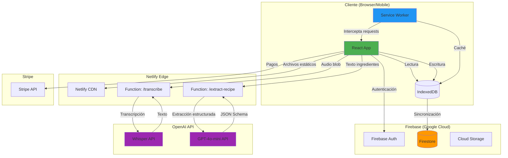

# 🏗️ Arquitectura Técnica - FreeCooking

## Visión General

FreeCooking se basa en una arquitectura **offline-first** y **serverless**, diseñada para ofrecer una experiencia de usuario instantánea incluso en entornos con conectividad intermitente (cocinas comerciales). La arquitectura combina React en el frontend con Firebase como Backend-as-a-Service (BaaS) y Netlify Functions como capa de proxy para proteger las API keys de OpenAI.

## 🎯 Principios Arquitectónicos

1. **Offline-First**: El usuario nunca espera por la red. Todas las operaciones de lectura/escritura se realizan primero en local.
2. **Zero-Setup UX**: La IA elimina la fricción de configuración inicial (no se requiere crear un inventario previo).
3. **Security by Design**: Ninguna API key se expone en el frontend. Todo pasa por funciones serverless.
4. **Progressive Enhancement**: La app funciona sin JavaScript (HTML básico), mejora con JS, y se convierte en PWA instalable.
5. **Cost Optimization**: Uso de GPT-4o-mini (60% más barato que GPT-3.5) y caché agresiva para minimizar llamadas a API.

---

## 📐 Diagrama de Arquitectura



---

## 🧱 Componentes Principales

### 1. Frontend (React + Vite)

**Tecnologías**:
- **React 18**: Librería UI con Concurrent Rendering para mejorar rendimiento en dispositivos de gama media
- **Vite**: Build tool ultra-rápido (HMR < 50ms)
- **TailwindCSS**: Framework CSS utilitario para diseño responsive
- **Recharts**: Librería de visualización para gráficos de dispersión (Matriz de Ingeniería de Menús)

**Gestión de Dependencias**:

El proyecto utiliza **npm** como gestor de paquetes. Todas las dependencias están definidas en `package.json`:

- **Dependencias de producción** (13 paquetes):
  - `react`, `react-dom`, `react-router-dom` - Framework UI y routing
  - `firebase` - Backend-as-a-Service (Firestore, Auth)
  - `zustand` - State management
  - `recharts` - Visualizaciones y gráficos
  - `framer-motion` - Animaciones
  - `lucide-react` - Iconos
  - `workbox-window` - Service Worker para PWA
  - `@capacitor/core` - Core de Capacitor para apps nativas
  - `@capacitor-firebase/authentication` - Autenticación de Firebase para Capacitor
  - `capacitor-native-biometric` - Autenticación biométrica nativa
  - `axios` - Cliente HTTP para comunicación con backend

- **Dependencias de desarrollo** (18 paquetes):
  - `vite`, `@vitejs/plugin-react` - Build tool
  - `tailwindcss`, `postcss`, `autoprefixer` - Estilos
  - `eslint` + plugins - Linting de código
  - `@types/react`, `@types/react-dom` - TypeScript types
  - `openai` - Integración con API (usado en Netlify Functions)
  - `busboy` - Parseo de FormData
  - `vite-plugin-pwa` - Generación de PWA

**Módulos clave**:

```javascript
// src/services/firebase.js
import { initializeApp } from 'firebase/app';
import { getFirestore, enableIndexedDbPersistence } from 'firebase/firestore';

const firebaseConfig = {
  apiKey: import.meta.env.VITE_FIREBASE_API_KEY,
  projectId: "your-project-id",
  // ...
};

const app = initializeApp(firebaseConfig);
const db = getFirestore(app);

// CRÍTICO: Habilitar persistencia offline
enableIndexedDbPersistence(db)
  .catch((err) => {
    if (err.code === 'failed-precondition') {
      console.warn('Múltiples tabs abiertas, persistencia deshabilitada');
    } else if (err.code === 'unimplemented') {
      console.warn('Navegador no soporta persistencia');
    }
  });

export { db };
```

**Estrategia de Estado Global**:
- **Zustand** (recomendado sobre Redux por simplicidad): 
  - Store para recetas, ingredientes, configuración de usuario
  - Middleware para sincronización automática con Firestore
  - Persistencia en localStorage para datos no sensibles (preferencias UI)

```javascript
// src/store/recipeStore.js
import create from 'zustand';
import { persist } from 'zustand/middleware';

export const useRecipeStore = create(
  persist(
    (set) => ({
      recipes: [],
      addRecipe: (recipe) => set((state) => ({ 
        recipes: [...state.recipes, recipe] 
      })),
      updateRecipe: (id, updates) => set((state) => ({
        recipes: state.recipes.map(r => r.id === id ? {...r, ...updates} : r)
      })),
    }),
    { name: 'freecooking-recipes' }
  )
);
```

---

### 2. Progressive Web App (PWA)

**Manifest.json**:
```json
{
  "name": "FreeCooking - Inteligencia de Costes",
  "short_name": "FreeCooking",
  "description": "Gestión de costes y precios para restaurantes con IA",
  "start_url": "/",
  "display": "standalone",
  "background_color": "#1a1a1a",
  "theme_color": "#4CAF50",
  "icons": [
    {
      "src": "/icons/icon-192.png",
      "sizes": "192x192",
      "type": "image/png"
    },
    {
      "src": "/icons/icon-512.png",
      "sizes": "512x512",
      "type": "image/png"
    }
  ],
  "orientation": "portrait"
}
```

**Service Worker (Workbox)**:

Estrategia de caché híbrida:
- **Precache**: HTML, CSS, JS, iconos (generado automáticamente en build)
- **Runtime Cache**: 
  - Imágenes: **Cache First** (con expiración de 30 días)
  - API Calls: **Network First** con fallback a caché (timeout 3s)
  - Firestore: Manejado nativamente por Firebase SDK

```javascript
// vite.config.js
import { VitePWA } from 'vite-plugin-pwa';

export default defineConfig({
  plugins: [
    react(),
    VitePWA({
      registerType: 'autoUpdate',
      workbox: {
        globPatterns: ['**/*.{js,css,html,ico,png,svg,woff2}'],
        runtimeCaching: [
          {
            urlPattern: /^https:\/\/fonts\.googleapis\.com\/.*/i,
            handler: 'CacheFirst',
            options: {
              cacheName: 'google-fonts-cache',
              expiration: {
                maxEntries: 10,
                maxAgeSeconds: 60 * 60 * 24 * 365 // 1 año
              }
            }
          }
        ]
      }
    })
  ]
});
```

---

### 3. Backend (Firebase)

**Firestore - Modelo de Datos**:

```
/users/{userId}
  - email: string
  - displayName: string
  - subscriptionTier: "free" | "pro"
  - subscriptionExpiry: timestamp
  - createdAt: timestamp
  
  /recipes/{recipeId}
    - name: string
    - category: string (entrante, principal, postre)
    - servings: number
    - prepTime: number (minutos)
    - laborCost: number (€)
    - totalCost: number (€ - calculado)
    - primeCost: number (€ - COGS + Labor)
    - salesPrice: number (€)
    - monthlySales: number (unidades vendidas)
    - createdAt: timestamp
    - updatedAt: timestamp
    
    /ingredients/{ingredientId}
      - name: string
      - quantity: number
      - unit: string (kg, g, l, ml, unidades)
      - costPerUnit: number (€)
      - supplier: string (opcional)
      - wastePercentage: number (% merma)
```

**Reglas de Seguridad**:

```javascript
rules_version = '2';
service cloud.firestore {
  match /databases/{database}/documents {
    // Helper functions
    function isAuthenticated() {
      return request.auth != null;
    }
    
    function isOwner(userId) {
      return request.auth.uid == userId;
    }
    
    function hasProSubscription(userId) {
      return get(/databases/$(database)/documents/users/$(userId))
        .data.subscriptionTier == 'pro' &&
        get(/databases/$(database)/documents/users/$(userId))
        .data.subscriptionExpiry > request.time;
    }
    
    // Reglas
    match /users/{userId} {
      allow read: if isAuthenticated() && isOwner(userId);
      allow create: if isAuthenticated();
      allow update: if isOwner(userId);
      
      match /recipes/{recipeId} {
        allow read, write: if isOwner(userId);
        
        // Límite de 5 recetas en plan gratuito
        allow create: if isOwner(userId) && (
          hasProSubscription(userId) ||
          get(/databases/$(database)/documents/users/$(userId)/recipes).size() < 5
        );
        
        match /ingredients/{ingredientId} {
          allow read, write: if isOwner(userId);
        }
      }
    }
  }
}
```

**Firebase Authentication**:
- Email/Password (flujo principal)
- Google Sign-In (opcional, para onboarding rápido)
- Recuperación de contraseña con enlace de email

---

### 4. Netlify Functions (Proxy para OpenAI)

**¿Por qué Netlify Functions?**
1. **Seguridad**: API Key de OpenAI nunca se expone al frontend
2. **CORS**: Evita problemas de Cross-Origin
3. **Rate Limiting**: Control de uso por usuario (prevenir abuso)
4. **Logging**: Monitoreo centralizado de costos de IA

**Función 1: Transcripción de Voz**

```javascript
// netlify/functions/transcribe.js
import { Configuration, OpenAIApi } from 'openai';
import formidable from 'formidable';

const configuration = new Configuration({
  apiKey: process.env.OPENAI_API_KEY,
});
const openai = new OpenAIApi(configuration);

export async function handler(event, context) {
  // Verificar autenticación (JWT de Firebase)
  const authHeader = event.headers.authorization;
  if (!authHeader || !authHeader.startsWith('Bearer ')) {
    return {
      statusCode: 401,
      body: JSON.stringify({ error: 'No autorizado' }),
    };
  }
  
  try {
    // Parsear FormData (audio blob)
    const form = new formidable.IncomingForm();
    const { files } = await new Promise((resolve, reject) => {
      form.parse(event, (err, fields, files) => {
        if (err) reject(err);
        resolve({ files });
      });
    });
    
    const audioFile = files.audio;
    
    // Llamar a Whisper API
    const response = await openai.createTranscription(
      audioFile,
      'whisper-1',
      undefined, // prompt (opcional)
      'json',
      0.2 // temperature (menor = más conservador)
    );
    
    return {
      statusCode: 200,
      body: JSON.stringify({ 
        text: response.data.text,
        cost: calculateWhisperCost(audioFile.size) // Tracking de costos
      }),
    };
  } catch (error) {
    console.error('Error en transcripción:', error);
    return {
      statusCode: 500,
      body: JSON.stringify({ error: 'Error al transcribir audio' }),
    };
  }
}

function calculateWhisperCost(audioSizeBytes) {
  // Whisper cobra $0.006 por minuto
  // Estimación: 1MB ≈ 1 minuto de audio a 128kbps
  const estimatedMinutes = audioSizeBytes / (1024 * 1024);
  return estimatedMinutes * 0.006;
}
```

**Función 2: Extracción de Ingredientes**

```javascript
// netlify/functions/extract-recipe.js
import { Configuration, OpenAIApi } from 'openai';

const configuration = new Configuration({
  apiKey: process.env.OPENAI_API_KEY,
});
const openai = new OpenAIApi(configuration);

// JSON Schema para Structured Outputs
const ingredientSchema = {
  type: "object",
  properties: {
    ingredients: {
      type: "array",
      items: {
        type: "object",
        properties: {
          name: { type: "string", description: "Nombre del ingrediente normalizado" },
          quantity: { type: "number", description: "Cantidad numérica" },
          unit: { 
            type: "string", 
            enum: ["kg", "g", "l", "ml", "unidades"],
            description: "Unidad métrica estándar"
          },
          estimatedCost: { 
            type: "number", 
            description: "Coste estimado en euros (0 si desconocido)" 
          },
          notes: { type: "string", description: "Notas adicionales (ej: 'calidad premium')" }
        },
        required: ["name", "quantity", "unit"]
      }
    },
    servings: { type: "number", description: "Número de raciones" },
    prepTime: { type: "number", description: "Tiempo de preparación en minutos" }
  },
  required: ["ingredients", "servings"]
};

export async function handler(event, context) {
  const { recipeText, userId } = JSON.parse(event.body);
  
  // Verificar suscripción del usuario (consultar Firestore)
  // TODO: Implementar rate limiting por usuario
  
  try {
    const response = await openai.createChatCompletion({
      model: "gpt-4o-mini",
      messages: [
        {
          role: "system",
          content: `Eres un experto en escandallos de restaurante. Extrae los ingredientes del texto proporcionado.
          
          Reglas:
          - Convierte todas las cantidades a unidades métricas (kg, g, l, ml)
          - "Una pizca" = 2g, "Un puñado" = 30g, "Un chorrito" = 15ml
          - Si se menciona "al gusto", estima una cantidad razonable
          - Normaliza nombres (ej: "Aceite de oliva virgen extra" → "Aceite de oliva")
          - Estima tiempos de preparación si no se mencionan`
        },
        {
          role: "user",
          content: recipeText
        }
      ],
      response_format: {
        type: "json_schema",
        json_schema: {
          name: "recipe_extraction",
          schema: ingredientSchema
        }
      },
      temperature: 0.3
    });
    
    const extracted = JSON.parse(response.data.choices[0].message.content);
    
    // Calcular costo de la llamada
    const { prompt_tokens, completion_tokens } = response.data.usage;
    const cost = (prompt_tokens * 0.15 / 1_000_000) + (completion_tokens * 0.60 / 1_000_000);
    
    return {
      statusCode: 200,
      body: JSON.stringify({ 
        data: extracted,
        metadata: {
          cost,
          tokensUsed: prompt_tokens + completion_tokens
        }
      }),
    };
  } catch (error) {
    console.error('Error en extracción:', error);
    return {
      statusCode: 500,
      body: JSON.stringify({ error: 'Error al extraer ingredientes' }),
    };
  }
}
```

---

### 5. Lógica de Negocio: Cálculo de Costos

**Fórmulas Implementadas**:

```javascript
// src/services/pricingLogic.js

/**
 * Calcula el Costo de Bienes Vendidos (COGS)
 * @param {Array} ingredients - Lista de ingredientes con { quantity, unit, costPerUnit, wastePercentage }
 * @returns {number} - Costo total en €
 */
export function calculateCOGS(ingredients) {
  return ingredients.reduce((total, ing) => {
    const baseCost = (ing.quantity * ing.costPerUnit);
    const wasteAdjusted = baseCost * (1 + (ing.wastePercentage || 0) / 100);
    return total + wasteAdjusted;
  }, 0);
}

/**
 * Calcula el Costo Primo (COGS + Mano de Obra)
 * @param {number} cogs - Costo de ingredientes
 * @param {number} prepTimeMinutes - Tiempo de preparación en minutos
 * @param {number} hourlyRate - Tarifa horaria del personal (€/hora)
 * @returns {number} - Costo Primo en €
 */
export function calculatePrimeCost(cogs, prepTimeMinutes, hourlyRate = 12) {
  const laborCost = (prepTimeMinutes / 60) * hourlyRate;
  return cogs + laborCost;
}

/**
 * Recomienda precio de venta basado en margen objetivo
 * @param {number} primeCost - Costo Primo
 * @param {number} targetMarginPercent - Margen objetivo (ej: 60 para 60%)
 * @returns {object} - { suggestedPrice, markup, fcPercent }
 */
export function suggestPrice(primeCost, targetMarginPercent = 60) {
  const suggestedPrice = primeCost / (1 - targetMarginPercent / 100);
  const markup = suggestedPrice / primeCost;
  const fcPercent = (primeCost / suggestedPrice) * 100;
  
  return {
    suggestedPrice: roundToNearestPsychological(suggestedPrice),
    markup: markup.toFixed(2),
    fcPercent: fcPercent.toFixed(1)
  };
}

/**
 * Redondea a precios psicológicos (.50, .95 o enteros)
 */
function roundToNearestPsychological(price) {
  if (price < 5) {
    // Precios bajos: .95
    return Math.ceil(price - 0.05) + 0.95;
  } else if (price < 15) {
    // Precios medios: .50
    return Math.round(price * 2) / 2;
  } else {
    // Precios altos: enteros (implica calidad)
    return Math.round(price);
  }
}

/**
 * Clasifica un plato en la Matriz de Ingeniería de Menús
 * @param {number} profitMargin - Margen de beneficio %
 * @param {number} monthlySales - Ventas mensuales (unidades)
 * @param {number} avgMargin - Margen promedio del menú
 * @param {number} avgSales - Ventas promedio del menú
 * @returns {string} - "star" | "plow" | "puzzle" | "dog"
 */
export function classifyMenuItem(profitMargin, monthlySales, avgMargin, avgSales) {
  const highProfit = profitMargin >= avgMargin;
  const highSales = monthlySales >= avgSales;
  
  if (highProfit && highSales) return "star";
  if (!highProfit && highSales) return "plow";
  if (highProfit && !highSales) return "puzzle";
  return "dog";
}
```

---

### 6. Visualización: Matriz de Ingeniería de Menús

**Componente React con Recharts**:

```jsx
// src/components/MenuMatrix/MenuMatrix.jsx
import { ScatterChart, Scatter, XAxis, YAxis, CartesianGrid, Tooltip, Cell, ResponsiveContainer } from 'recharts';

const QUADRANT_COLORS = {
  star: '#4CAF50',    // Verde
  plow: '#FFC107',    // Amarillo
  puzzle: '#2196F3',  // Azul
  dog: '#F44336'      // Rojo
};

export function MenuMatrix({ recipes }) {
  // Calcular promedios
  const avgMargin = recipes.reduce((sum, r) => sum + r.profitMargin, 0) / recipes.length;
  const avgSales = recipes.reduce((sum, r) => sum + r.monthlySales, 0) / recipes.length;
  
  // Preparar datos para el gráfico
  const dataPoints = recipes.map(recipe => ({
    x: recipe.monthlySales,
    y: recipe.profitMargin,
    name: recipe.name,
    category: classifyMenuItem(recipe.profitMargin, recipe.monthlySales, avgMargin, avgSales)
  }));
  
  return (
    <ResponsiveContainer width="100%" height={400}>
      <ScatterChart margin={{ top: 20, right: 20, bottom: 20, left: 20 }}>
        <CartesianGrid strokeDasharray="3 3" />
        <XAxis 
          type="number" 
          dataKey="x" 
          name="Ventas Mensuales" 
          label={{ value: 'Popularidad (Ventas)', position: 'bottom' }}
        />
        <YAxis 
          type="number" 
          dataKey="y" 
          name="Margen de Beneficio (%)" 
          label={{ value: 'Rentabilidad (%)', angle: -90, position: 'left' }}
        />
        <Tooltip 
          content={({ active, payload }) => {
            if (active && payload?.[0]) {
              const data = payload[0].payload;
              return (
                <div className="bg-white p-3 rounded shadow-lg border">
                  <p className="font-bold">{data.name}</p>
                  <p>Ventas: {data.x} uds/mes</p>
                  <p>Margen: {data.y.toFixed(1)}%</p>
                  <p className="text-xs mt-1 text-gray-600">
                    {getCategoryName(data.category)}
                  </p>
                </div>
              );
            }
            return null;
          }}
        />
        
        {/* Líneas de referencia para dividir cuadrantes */}
        <ReferenceLine x={avgSales} stroke="#666" strokeDasharray="3 3" />
        <ReferenceLine y={avgMargin} stroke="#666" strokeDasharray="3 3" />
        
        <Scatter data={dataPoints}>
          {dataPoints.map((entry, index) => (
            <Cell key={`cell-${index}`} fill={QUADRANT_COLORS[entry.category]} />
          ))}
        </Scatter>
      </ScatterChart>
    </ResponsiveContainer>
  );
}

function getCategoryName(category) {
  const names = {
    star: '⭐ Estrella - Mantener y promocionar',
    plow: '🐴 Caballo de Batalla - Reducir costos',
    puzzle: '🧩 Puzzle - Investigar barreras',
    dog: '🐕 Perro - Considerar eliminar'
  };
  return names[category] || '';
}
```

---

## 🔐 Seguridad

### Protección de API Keys

```env
# .env (NUNCA en Git - usar .env.example)
VITE_FIREBASE_API_KEY=AIza...
VITE_FIREBASE_PROJECT_ID=your-project-id
VITE_STRIPE_PUBLIC_KEY=pk_test_...

# Variables de Netlify Functions (solo servidor)
OPENAI_API_KEY=sk-proj-...
STRIPE_SECRET_KEY=sk_test_...
```

**.gitignore**:
```
.env
.env.local
.env.*.local
```

### Validación RGPD

```javascript
// src/utils/validation.js
export function validateGDPRConsent(user) {
  const consentTimestamp = user.gdprConsentDate;
  const consentVersion = user.gdprConsentVersion;
  
  // La política actual es v1.0 (actualizar si cambia)
  if (!consentTimestamp || consentVersion !== '1.0') {
    return { valid: false, requiresUpdate: true };
  }
  
  return { valid: true };
}

export async function exportUserData(userId) {
  // Implementar según Art. 20 RGPD (Derecho a la portabilidad)
  const firestore = getFirestore();
  const userRef = doc(firestore, 'users', userId);
  const snapshot = await getDoc(userRef);
  
  // Incluir todas las subcolecciones
  const recipes = await getDocs(collection(userRef, 'recipes'));
  
  return {
    user: snapshot.data(),
    recipes: recipes.docs.map(d => d.data()),
    exportDate: new Date().toISOString(),
    format: 'JSON'
  };
}

export async function deleteUserData(userId) {
  // Implementar según Art. 17 RGPD (Derecho al olvido)
  // IMPORTANTE: Usar transacciones para garantizar atomicidad
}
```

---

## 📊 Monitoreo y Observabilidad

### Métricas Clave a Trackear

1. **Performance**:
   - Tiempo de carga inicial (< 2s)
   - Tiempo de interacción (FID < 100ms)
   - Largest Contentful Paint (LCP < 2.5s)

2. **Costos de IA**:
   - Gasto por usuario/mes
   - Tokens promedio por receta
   - Tasa de acierto de IA (% sin correcciones manuales)

3. **Negocio**:
   - Tasa de conversión Free → Pro
   - Churn rate (cancelaciones)
   - Recetas creadas por usuario

**Implementación con Plausible Analytics** (alternativa RGPD-friendly a Google Analytics):

```html
<!-- index.html -->
<script defer data-domain="freecooking.app" src="https://plausible.io/js/script.js"></script>
```

---

## 🚀 Deployment Pipeline

```yaml
# netlify.toml
[build]
  command = "npm run build"
  publish = "dist"
  
[[redirects]]
  from = "/*"
  to = "/index.html"
  status = 200

[build.environment]
  NODE_VERSION = "18"

[context.production.environment]
  VITE_ENV = "production"

[[headers]]
  for = "/manifest.json"
  [headers.values]
    Content-Type = "application/manifest+json"
    
[[headers]]
  for = "/sw.js"
  [headers.values]
    Cache-Control = "public, max-age=0, must-revalidate"
```

**Build Process**:
1. Vite compila React → ES modules optimizados
2. Workbox genera Service Worker con lista de precaché
3. Netlify despliega a CDN global (150+ ubicaciones)
4. Functions se despliegan como AWS Lambda@Edge

---

## 💰 Estimación de Costos de Infraestructura

| Servicio | Plan | Costo/mes (100 usuarios) |
|----------|------|--------------------------|
| Netlify | Pro | $0 (Starter gratuito hasta 300GB bandwidth) |
| Firebase (Firestore) | Pay-as-you-go | ~$5 (1M lecturas, 500k escrituras) |
| Firebase (Auth) | Gratis | $0 (hasta 50k usuarios) |
| OpenAI API | Pay-as-you-go | ~$10 (50 recetas/usuario/mes) |
| Stripe | 1.5% + 0.25€ | ~$15 (10% tasa de conversión) |
| **Total** | | **~$30/mes** |

**Margen**: 100 usuarios × 10€ × 10% conversión = 100€/mes ingreso. **Margen bruto: 70%**

---

## 🔄 Sincronización Offline

**Flujo de Sincronización**:

```javascript
// src/hooks/useOfflineSync.js
import { useEffect } from 'react';
import { onSnapshot } from 'firebase/firestore';
import { useRecipeStore } from '../store/recipeStore';

export function useOfflineSync(userId) {
  const { setRecipes, addPendingSync } = useRecipeStore();
  
  useEffect(() => {
    const recipesRef = collection(db, `users/${userId}/recipes`);
    
    // Escuchar cambios en tiempo real
    const unsubscribe = onSnapshot(
      recipesRef,
      (snapshot) => {
        const recipes = snapshot.docs.map(doc => ({
          id: doc.id,
          ...doc.data()
        }));
        setRecipes(recipes);
      },
      (error) => {
        console.error('Error de sincronización:', error);
        // Modo offline: usar datos locales
      }
    );
    
    return () => unsubscribe();
  }, [userId]);
  
  // Listener de estado de conexión
  useEffect(() => {
    const handleOnline = () => {
      console.log('Conexión restaurada, sincronizando...');
      // Firestore automáticamente envía escrituras pendientes
    };
    
    window.addEventListener('online', handleOnline);
    return () => window.removeEventListener('online', handleOnline);
  }, []);
}
```

---

## 📚 Referencias Técnicas

- [Firebase Offline Persistence](https://firebase.google.com/docs/firestore/manage-data/enable-offline)
- [OpenAI Structured Outputs](https://platform.openai.com/docs/guides/structured-outputs)
- [Workbox PWA Guide](https://developers.google.com/web/tools/workbox)
- [Netlify Functions](https://docs.netlify.com/functions/overview/)
- [RGPD - Guía para Desarrolladores](https://gdpr.eu/developers/)

---

**Última actualización**: 2025-11-21
