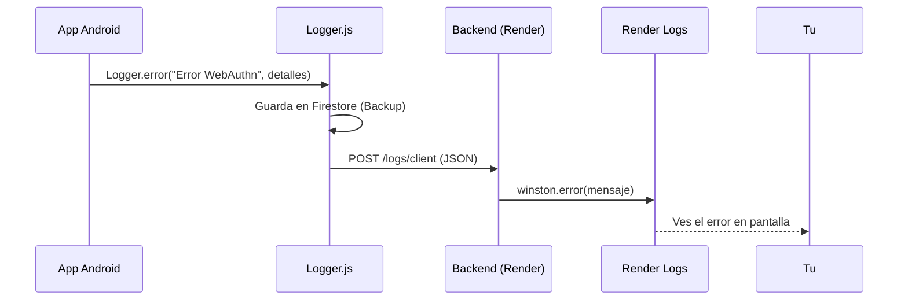

# 📡 Sistema de Diagnóstico Remoto - FreeCooking

Como solicitaste, aquí está la explicación detallada de cómo funciona el sistema de logs que acabamos de implementar para diagnosticar problemas en dispositivos móviles.

## 🔄 Flujo de Datos

1. **Origen**: La app Android (React/Capacitor) encuentra un error (ej: WebAuthn falla).
2. **Captura**: `Logger.error()` o `Logger.warn()` son llamados.
3. **Envío**: El Logger envía una petición POST silenciosa a tu backend.
4. **Almacenamiento**: El backend (Render) recibe el log, lo procesa con Winston y lo muestra en su consola.
5. **Visualización**: Tú ves el error en tiempo real en el Dashboard de Render.



## 🛠️ Implementación Técnica

### 1. Frontend (`Logger.js`)

Hemos modificado el logger para usar `fetch` nativo (evitando dependencias circulares con axios) y enviar los datos al endpoint configurado en `VITE_BACKEND_URL`.

```javascript
// Detecta la URL del backend desde .env
const backendUrl = import.meta.env.VITE_BACKEND_URL;

// Estructura del payload
const payload = {
    level: 'error',       // o 'warn'
    message: 'Error...',  // Mensaje principal
    context: {            // Metadatos cruciales para debug
        platform: 'android',
        userAgent: 'Mozilla/5.0...',
        url: 'http://localhost...',
        details: [...]    // El objeto de error completo
    }
};
```

### 2. Backend (`logsController.js`)

El backend ya estaba preparado para recibir esto. Cuando llega el POST a `/logs/client`:
1. Valida los datos.
2. Agrega la IP del cliente.
3. Loguea usando Winston con el prefijo `[CLIENT]`.

## 🔍 Cómo Diagnosticar tu Error

Ahora que el sistema está implementado y mejorado:

1. **Rebuild & Install**:
   ```bash
   npx cap open android
   # Build > Rebuild Project
   # Run en tu Samsung
   ```

2. **Provoca el Error**:
   - Intenta el login con huella en tu móvil.

3. **Revisa Render**:
   - Ve a Dashboard > FreeCooking Backend > Logs.
   - Busca líneas con prefijo `[CLIENT]`.
   - **Ahora verás la traza completa (INFO)**:
     - `🔐 Solicitando login challenge a...`
     - `✅ Login challenge recibido...`
     - `📱 Solicitando autenticación al usuario...`
     - `❌ Error...`

Esto nos permitirá saber EXACTAMENTE en qué paso se rompe (si es red, si es el navegador, o si es la verificación).

## 🛡️ Seguridad

- **Sanitización**: El logger elimina automáticamente contraseñas o tokens antes de enviar.
- **Fail-safe**: Si el backend no responde, el logger falla silenciosamente para no afectar la experiencia de usuario.
